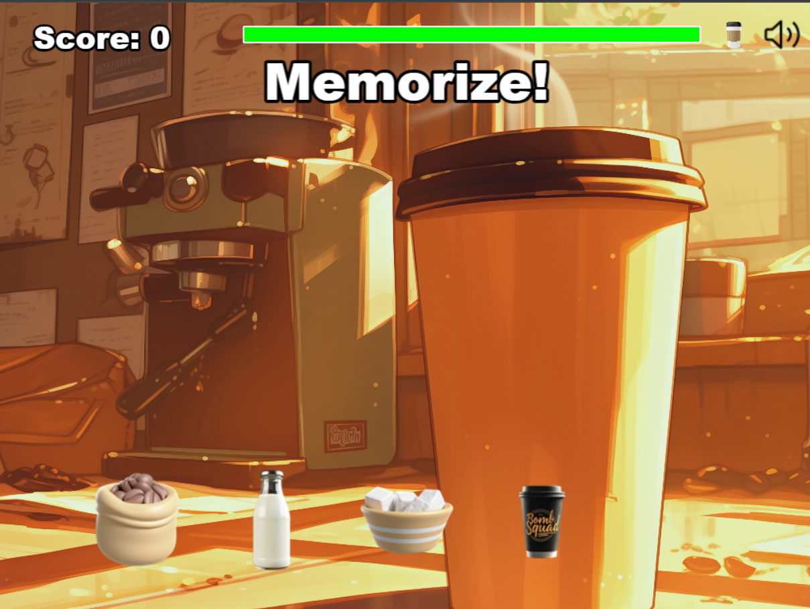

# Bomb Squad Barista BSB 

Welcome to **Bomb Squad Barista**! A fast-paced, "Simon Says" style memory game where you must flawlessly mix high-stakes coffee orders before time runs out. As the chosen barista for a very... *particular* clientele, every order is a challenge and every mistake is explosive. Can you handle the pressure?



---

## ► How To Play

The goal is simple, but the job is anything but.

1.  **Memorize the Order**: At the start of each round, the game will show you a sequence of ingredients by making the buttons "pop."
2.  **Repeat the Sequence**: Once the sequence is finished, it's your turn! Click the ingredient buttons in the exact same order.
3.  **Beat the Clock**: You must complete the order before the green timer bar at the top of the screen runs out.
4.  **Stay Focused**: One wrong ingredient and it's **Game Over!**

---

##  Features

* **Classic Memory Gameplay**: Watch the sequence, repeat it. Simple to learn, difficult to master.
* **Increasing Difficulty**: Orders get longer and the timer gets shorter as your score increases.
* **Unlockable Ingredient**: Prove your skills by scoring over 10 points to unlock the prestigious **espresso** shot.
* **🔥 RUSH ORDERS!**: After reaching a score of 12, you may be thrown into a "Rush Order"—a series of rapid-fire orders for a massive point bonus!
* **Persistent High Score**: The game saves your highest score locally in your browser.
* **Full Audio Control**: A persistent mute button allows you to toggle all game music and sound effects on or off, with the setting remembered across all scenes.
* **Custom Logo & UI**: A fully-featured main menu and game over screen.

---

##  Project Structure

The game is organized into several Phaser Scenes, each with a specific role:

* `main.js`: The main entry point. Configures the Phaser game instance and lists all the scenes.
* `scenes/Boot.js`: The very first scene. Loads the minimal assets required for the preloader screen.
* `scenes/Preloader.js`: Loads all game assets (images, audio) and displays a progress bar.
* `scenes/MainMenu.js`: The main title screen with the game logo and start button.
* `scenes/Game.js`: The core gameplay scene where all the action happens.
* `scenes/GameOver.js`: The screen that displays your final score and the current high score.

---

##  How to Run Locally

This game is built with **Phaser 3** and can be run in any modern web browser. To set it up on your local machine, you need to serve the project files from a local web server.

1.  **Prerequisites**: Make sure you have [Node.js](https://nodejs.org/) installed.

2.  **Download the Code**: Place all the project files into a single folder on your computer.
`
https://github.com/ashwin-qh/bsb-game.git
`
3.  **Start a Local Server**:
    * **Using Node.js (with `npm`)**:
        Open your terminal in the project folder and run:
        ```bash
        npm install
        npm run dev
        ```
4.  **Play the Game**: Open your web browser and navigate to the local address provided by your server (usually `http://localhost:8080` for `node` 
---

## 💻 Technologies Used

* **Game Engine**: [Phaser 3](https://phaser.io/)
* **Language**: JavaScript (ES6 Modules)
* **Platform**: HTML5 Canvas

